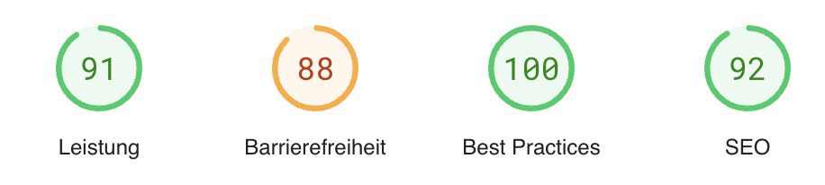
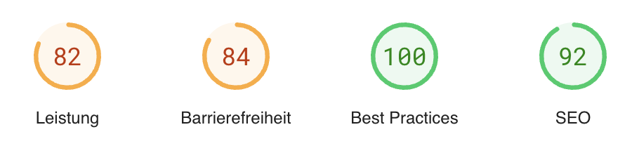
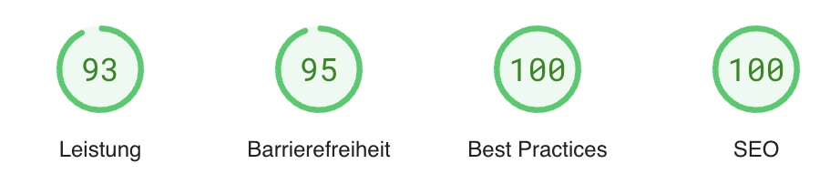
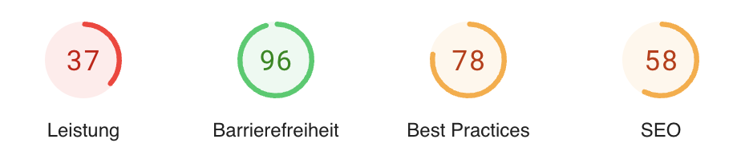

# Barrierefreiheit

Auf den Postern der lernOS Convention (#loscon23) steht schon seit dem ersten Mal der Slogan **“All Creatures Welcome”**, d.h. wir möchten allen Wesen eine möglichst reibungsfreie und angenehme Teilnahme ermöglichen. Bei den physischen Räumlichkeiten unserer Lokation wurden schon ziemlich viele Aspekte der **Barrierefreiheit** [berücksichtigt](https://www.reisen-fuer-alle.de/jugendherberge_nuernberg_249.html?action=detail&item_id=407). Deswegen fokussieren wir im Orga-Team auf die digitale Infrastruktur und testen die **Haupt-Anwendungen der loscon** mit [Google Lighthouse](https://chrome.google.com/webstore/detail/lighthouse/blipmdconlkpinefehnmjammfjpmpbjk?hl=de). Hier werden wir die Ergebnisse veröffentlichen:

## loscon24 Infoseiten

## loscon24 Programm (pretalx)

## loscon24 Merch-Shop (spreadshirt)

## Microsoft Teams (Web-Version)

Microsoft Teams lies sich leider mit Lighthouse nicht testen. Daher können wir hier nur den Link zu den [Barrierefreiheit-Funktionen von Teams](https://www.microsoft.com/de-de/microsoft-teams/accessibility-closed-captions-transcriptions) anbieten.

## Discord (Web-Version)

## Conceptboard
**Hinweis:** nachdem unser **Whiteboard** (Conceptboard) mit **72/100 Punkten** einen recht schlechten Wert der Barrierefreiheit hatte und sich Whiteboards für hybride Events ohnehin nicht so gut eignenen (schlecht mit mobilen Endgeräten zu bedienen, nicht responsiv), werden wir dieses Jahr auf ein globales Whiteboard verzichten. In Sesssion können aber Pads und Whiteboards eingesetzt werden.