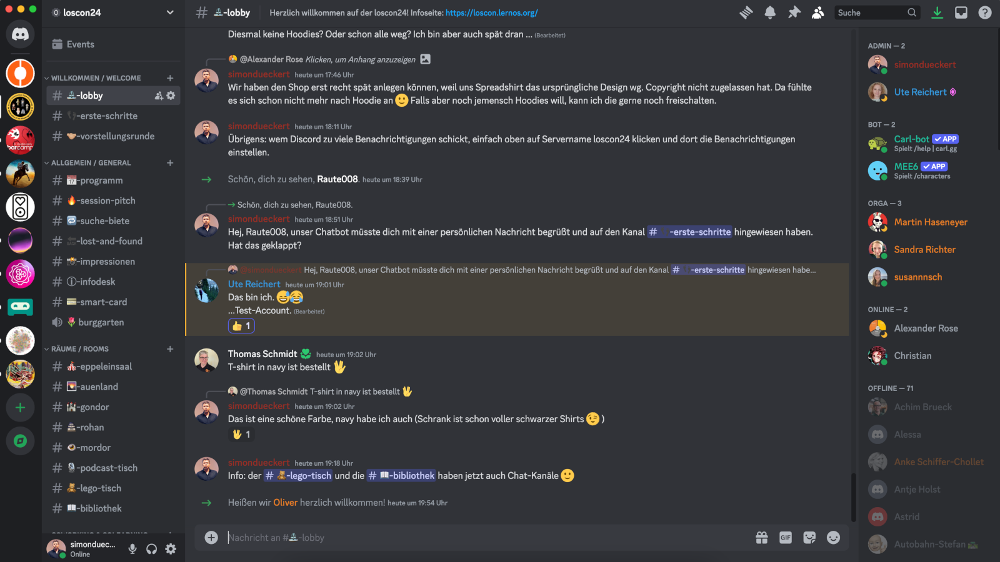

# Discord

Alle Teilnehmer:innen werden auf den loscon24 Discord-Server eingeladen. Dort findet ihr z.B. die Einwahllinks für das Programm, den virtuellen Infodesk, die Chats zu den Breakout-Räumen (2nd-Screen-Ansatz: Chat in Teams ist deaktiviert) und viel Raum für den hybriden Austausch. Ihr könnt Discord im Browser oder als Desktop- bzw. Mobil-App nutzen. Weitere Informationen zu Discord findet ihr im [Discord Hilfecenter](https://support.discord.com/hc/de).

Diese Kategorien (fett) und Kanäle haben wir im Server angelegt:

| Kategorie/Kanal            | Beschreibung                                                                                                                                                                                                            |
| -------------------------- | ----------------------------------------------------------------------------------------------------------------------------------------------------------------------------------------------------------------------- |
| **Willkommen / Welcome**   |                                                                                                                                                                                                                         |
| lobby                      | Hier kommen alle an, ein Ort für ungezwungene Gespräche                                                                                                                                                                 |
| erste-schritte             | Die wichtigsten Tipps für Discord-Newbies                                                                                                                                                                               |
| vorstellungsrunde          | Hier könnt ihr Euch mit Name, Organisation, Bild, Hashtags, Links vorstellen                                                                                                                                            |
|                            |                                                                                                                                                                                                                         |
| **Allgemein / General**    |                                                                                                                                                                                                                         |
| programm                   | Links zum [Programm](https://pretalx.com/loscon24/schedule/) und Teams-Einwahllinks für alle Räume                                                                                                                      |
| session-pitch              | Hier können Sessionvorschläge für die 8 offenen Sessions an Tag 2 eingereicht werden                                                                                                                                    |
| suche-biete                | Alles, was ihr sucht oder bietet (Mitfahrgelegenheit, Hilfe etc.)                                                                                                                                                       |
| lost-and-found             | Wenn was liegen bleibt oder gefunden wird hier posten                                                                                                                                                                   |
| impressionen               | Hier könnt ihr Schöne Bilder/Videos von der Veranstaltung teilen                                                                                                                                                        |
| ai-showroom                | Hier könnt ihr Ergebnisse eurer KI-Experimente teilen (Prompts, Systemprompts, Ausgaben, Bilder etc.)                                                                                                                   |
| smart-card                 | Austausch zur Verwendund der neuen [lernOS Smart Card](smartcard.md)                                                                                                                                                    |
| loscon24-chatbot           | Austausch zu Nutzung und Erfahrungen mit dem [loscon24 Chatbot](https://chatgpt.com/g/g-HU2NyTzOF-loscon24-chatbot)                                                                                                     |
| infodesk                   | Anlaufstelle bei allen Fragen, die in der [FAQ](faq.md) nicht beantwortet werden                                                                                                                                        |
| burggarten                 | Sprachkanal für ein entspannten Spaziergang im Burggarten                                                                                                                                                               |
|                            |                                                                                                                                                                                                                         |
| **Räume / Rooms**          |                                                                                                                                                                                                                         |
| eppeleinsaal               | Chat zum Programm im Eppeleinsaal (Bühne)                                                                                                                                                                               |
| auenland                   | Chat zum Programm im Raum Auenland                                                                                                                                                                                      |
| gondor                     | Chat zum Programm im Raum Gondor                                                                                                                                                                                        |
| rohan                      | Chat zum Programm im Raum Rohan                                                                                                                                                                                         |
| mordor                     | Chat zum Programm im Raum Mordor                                                                                                                                                                                        |
| lego-tisch                 | Zwangloser Plausch am [Lego-Tisch](lego.md)                                                                                                                                                                             |
| bibliothek                 | Austausch und Buchbesprechung zur [loscon24 Bibliothek](library.md)                                                                                                                                                     |
| prompt-battle              | Input-Kanal zum Prompt Battle im Abendprogramm                                                                                                                                                                          |
| podcast-tisch (Text)       | Koordination und Fragen zum [Podcast-Tisch](podcasting.md)                                                                                                                                                              |
| podcast-tisch (Audio)      | Sprachkanal, um Remote-Teilnehmer:innen in Podcasts einzubinden                                                                                                                                                         |
|                            |                                                                                                                                                                                                                         |
| **Dezentrale Lokationen**  |                                                                                                                                                                                                                         |
| chat-bern                  | Text-Chat für die Lokation Bern                                                                                                                                                                                         |
| voice-bern                 | Sprach-Chat für die Lokation Bern                                                                                                                                                                                       |
|                            |                                                                                                                                                                                                                         |
| **Coworking & Colearning** | Hier sind Sprachkanäle angelegt, die ihr z.B. für Eure Learning Circle umbenennen und damit belegen könne. Die freien Tische können alle verwenden                                                                      |
| anleitung                  | Kurze Anleitung, wie das Umbenennen der Kanäle funktioniert                                                                                                                                                             |
| tisch-x                    | Text- und Sprachkanäle für Euch, hier können wir beliebig viele anlegen. Ihr könnt sie nach Themen oder Namen eurer Learning Circle umbenennen.                                                                         |
|                            |                                                                                                                                                                                                                         |
| **Social Media**           | Videos von Youtube und [RSS-Feed #loscon24 von Mastodon](https://colearn.social/tags/loscon24.rss)                                                                                                                      |
| mastodon                   | Hier postet unserer Bot alle [Toots auf Mastodon mit Hashtag #loscon24](https://colearn.social/tags/loscon24). Wenn ihr noch kein Mastodon-Konto habt, legt gerne eines auf [colearn.social](https://colearn.social) an |
| youtube                    | Hier postet unserer Bot alle neuen Videos [im Youtube Kanal von Cogneon](https://youtube.com/cogneon) (z.B. Aufzeichnungen der Sessions)                                                                                |