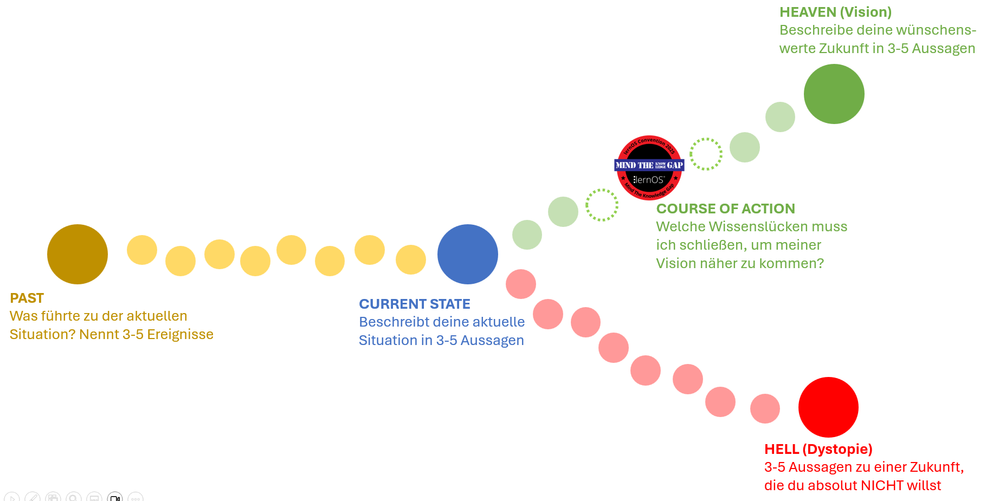

# Let's close the knowledge gap ... together!

Gemäß des **loscon25 Mottos** [Mind the Knowledge Gap](https://cogneon.de/2025/03/02/mind-the-knowledge-gap-das-motto-der-lernos-convention-2025/) haben wir uns ein Aktion für euch überlegt, wie ihr vorab **Wissenslücken identifizieren und gemeinsam schließen** könnet. Wir verwenden dafür die leicht modifizierte Methode [Future Backwards](https://cynefin.io/wiki/Future_backwards) von Dave Snowden. Gemäß unseres Mottos geht es dabei nicht nur um bekannte Wissenslücken, sondern auch um die [unknown unknowns](https://de.wikipedia.org/wiki/There_are_known_knowns).

## Wissenslücken finden - VOR der loscon

1. **Vorbereitung:** ladet euch die Grafik oben herunter oder kopiert sie auf ein Whiteboard eurer Wahl (oder verwendet [die PDF-Version](./img/loscon25-future-backwards.pdf) zum Ausdrucken oder in einer App zum Reinschreiben)
1. Nehmt euch vorab **25 Minuten Zeit** und beantwortet in je 5 Minuten die folgenden Fragen (das strikte [Timeboxing](https://de.wikipedia.org/wiki/Timeboxing) soll euch helfen, euch in kurzer Zeit auf das wesentliche zu fokussieren):
    1. **CURRENT STATE:** Beschreibt deine aktuelle Situation in 3-5 Aussagen (Hilfsfrage: Welche Entscheidungen musst du treffen und welche Probleme musst du lösen, zu denen du Wissen benötigst?)
    1. **PAST:** Was führte zu der aktuellen Situation? Nennt 3-5 Ereignisse
    1. **HEAVEN (Vision):** Beschreibe deine wünschenswerte Zukunft in 3-5 Aussagen (Die Vision kann 1 Jahr in der Zukunft liegen, aber auch 3-10 Jahre, je nachdem, wie langfristig du planen willst; Hilfsfrage: Welche Ziele hast du in diesem Zeitraum oder welche Trends wie z.B. KI, Resilienz beeinflussen in diesem Zeitraum dein Leben und/oder deine Arbeit?)
    1. **HELL (Dystopie):** 3-5 Aussagen zu einer Zukunft, die du absolut NICHT willst
    1. **COURSE OF ACTION:** Welche Wissenslücken musst du schließen, um meiner Vision näher zu kommen? Welche kannst du im Rahmen der loscon schließen, ggf. mit den 2-3 Monaten danach?
1. **Wähle** für die lernOS Convention 2025 **mindestens eine Wissenslücke** aus, die du gemeinsam mit anderen schließen möchtest.

## loscon Circles: Wissenslücken gemeinsam schließen - AUF der loscon

Mit der Einladung in den loscon25 [Discord-Server](discord.md) steht für euch der Kanal *circle-marktplatz* zur Verfügung, über den ihr Euch zu kleinen Lerngruppen (loscon Circles) von ca. 5 Personen zusammenschließen könnt, um gemeinsam Wissenslücken zu schließen. Zusammen mit der Einladung in Discord erhaltet ihr eine kleine Anleitung, wie ihr euch im Rahmen der Veranstaltung zu kleinen Lerngruppen zusammenfinden könnt, um an gemeinsamen Wissenslücken zu arbeiten. Hat sich ein Circle gefunden, gibt es einen Bereich auf dem loscon Whiteboard (Link und Passwort im Kanal *#programm*) auf dem ihr euch einen kleinen Bereich anlegen und ggf. auch mit anderen Circles verbinden könnt.