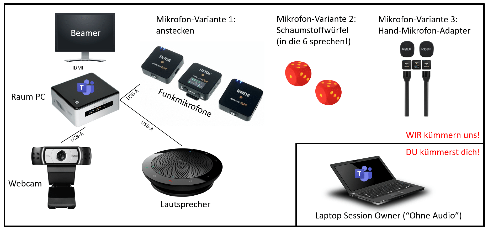

# Hybrid Meeting Kit

In den Breakout-Räumen wir wieder das [Hybrid Meeting Kit](https://wiki.cogneon.de/hmk) der Cogneon Akademie zusammen mit [Microsoft Teams](https://wiki.cogneon.de/teams) genutzt. Auf dieser Seite findet ihr alle Infos für Session Owner, Room Buddies und Teilnehmer:innen.



## Für Session Owner
- **ZEIT:** Seid als Session Owner bitte ca. 10 Minuten VOR eurer Session im Raum, damit ihr euch in Ruhe einrichten könnt.
- **HYBRID:** Denkt bitte an unser Prinzip "perfectly hybrid". Bindet die Remote-Teilnehmer:innen mit ein und achtet auf Online-Wortmeldungen und den Chat.
- **EIGENES ENDGERÄT:** Session Owner vor Ort müssen ihr Eigenes Endgerät (z.B. Laptop) mitbringen und sich im Raum in die Videokonferenz OHNE AUDIO einwählen. Ein "Room Buddy" (Raumbetreuer:in) steht bei Fragen und Problemen bereit.
- **HYBRID MEETING KIT:** In den Räumen vor Ort befinden sich PCs, die dauerhaft in die Videokonferenz des Raums eingewählt sind. An den PCs sind Hybrid Meeting Kits angeschlossen mit Webcam, Freisprecheinrichtung und zwei Funkmikrofone (wahlweise zum Anklipsen, als Handmikrofon oder im Schaumstoffwürfel zum Werfen).
- **WEBCAM:** Wenn ihr neben der Raumkamera in der Videokonferenz noch groß im Bild sein wollt, verwendet dafür z.B. die Webcam eures Endgeräts.
- **DOKUMENTATION:** denkt bitte an die Dokumentation eurer Session. Verwendete Dokumente oder Links zu Dokumentationen (z.B. Pad, Whiteboard) könnt ihr in Programm-System Pretalx bei eurem Programmpunkt in der Beschreibung oder als Anhang hinterlegen.
- **AUFZEICHNUNG:** Alle Sessions werden aufgezeichnet und hinterher auf YouTube als Dokumentation veröffentlicht. Wenn ihr das nicht wollt, könnt ihr das beim Call for Participation angeben (opt-out)

## Für Room Buddies (inkl. Moderation)
- **ZEIT:** Sei rechtzeitig in Deinem Raum (mindestens 15 Minuten vor Sessionbeginn).
- **VIDEOKONFERENZ:** Stelle sicher, dass der Raum PC in die richtige Videokonferenz eingewählt ist und dass die Kamera und das Mikrofon funktionieren.
- **TEAMS:** Stelle sicher, dass die Darstellung von Teams korrekt konfiguriert ist:
    - Vollbild: ```Ansicht -> Weitere Optionen -> Vollbild``` (damit der Inhalt so groß wie möglich dargestellt wird)
    - Speaker-Ansicht: ```Ansicht -> Sprecher*in``` (damit redende Personen automatisch groß und in besserer Qualität dargestellt werden)
    - Chat: ```Chat -> Ein```
    - Kamera: ```Poly Studio P15``` (Totale Kamera für den Raum)
    - Lautsprecher: ```Poly Studio P15``` (Lautsprecher für den Raum)
    - Mikrofon: ```Rode Wireless Go II``` (die beiden Funkmikrofone, eines zum Anstecken, eines im Würfel)
- **SESSION OWNER:** Kontaktiere den Session Owner, wenn er/sie nicht 10 Minuten vor Sessionbeginn im Raum ist.
- **SUPPORT:** Unterstütze den Session Owner wenn nötig, sich mit dem eigenen Rechner in die Videokonferenz einzuwählen (ACHTUNG: ohne Audio, da es sonst zu Rückkopplungen kommt).
- **REMOTLER:** Achte während der Session darauf, dass die Remote-Tln. berücksichtigt werden (z.B. bei Nachrichten/Fragen im Chat, wenn sie die Hand heben etc.)
- **STREAM-KONTROLLE:** (optional) Wähle Dich mit Deinem eigenen PC in die Videokonferenz ein, damit Du diese aus Sicht der Remote-Tln. erleben kannst. Verwende ein Headset, damit Du auch den Ton hörst und Probleme damit mitbekommst.


## Für Teilnehmer:innen VOR ORT
- **VIDEOKONFERENZ:** wähle dich mit deinem Endgerät vor Ort in die Videokonferenz ein. Achte darauf, dass du die Option ```Ohne Audio``` wählst, damit wir im Raum keine Rückkopplungen haben.
- **CHAT:** Für den Chat verwenden wir Discord als Plattform, Ihr erhaltet bei der Anmeldung einen Einladungslink per E-Mail dazu. Die Chaträume sind in Discord benannt, wie die Räume im Programm.
- **SECOND SCREEN:** zwei Bildschirme sind besser als einer! Vor-Ort-Teilnehmer:innen sollten auf jeden Fall ein eigenes Endgerät mitbringen, besser zwei. Wir empfehlen einen Laptop und ein Smartphone.
- **WEBCAM:** Wenn ihr neben der Raumkamera in der Videokonferenz noch groß im Bild sein wollt, verwendet dafür z.B. die Webcam eures Endgeräts.
- **BANDBREITE:** Die Bandbreite des Netzwerks vor Ort ist begrenzt. Schon Bandbreite, indem ihr z.B. unter ```Ansicht -> Weitere Optionen -> Eingehendes Video deaktivieren``` den Empfang von Video deaktiviert (ihr seht die Remote-Teilnehmenden ja in der Projektion vor Ort).

## Für Teilnehmer:innen REMOTE
- **AUDIOQUALITÄT:** Verwendet ein Headset oder eine Freisprecheinrichtung für gute Audioqualität. Mutet Euch, um keine Hintergrundgeräusche zu erzeugen.
- **NETZWERK:** LAN ist besser, als WLAN, achtet darauf, dass ihr gute Bandbreite und geringe Latenz habt.
- **ANZEIGE RAUMKAMERA:** Teams schneidet manchmal die Kamerabilder links und rechts ab. Das ist insbesondere bei der Raumkamera schlecht, weil ihr dann nur den Tisch und nicht mehr die Leute seht. Durch ```Rechtsklick``` auf einem Videobild in Teams und ```An Frame anpassen``` könnt ihr das ganze Bild anzeigen. Mit ```Für mich anheften``` auf dem Videobild der Raumkamera könnt ihr dafür sorgen, dass ihr den Raum immer seht.
- **MOBILE TEILNAHME:** sowohl die Teilnahme per Teams, als auch per Discord ist mit den jeweiligen Apps auch mobil möglich. Sitzt nicht den ganzen Tag am Schreibtisch (Sitzen ist der neue Krebs!), sondern wählt euch in Programmpunkte von mobilen Lokationen ein.
- **FEEDBACK:** wenn irgend etwas für euch nicht passt, meldet euch direkt per Chat oder Wortmeldung.