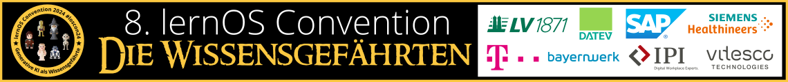

# Willkommen zur lernOS Convention 2024 💛

Die **lernOS Convention** ist das Top-Event zu **Wissensmanagement** und **Lernenden Organisationen** im deutschsprachigen Raum. Der digitale Arbeitsplatz, moderne Intranets, New Ways of Working und persönliches Wissensmanagement für Wissensarbeiter:innen und Lernende Teams sind die zentralen Themen.

Die **8. lernOS Convention** ([#loscon24](https://colearn.social/tags/loscon24)) findet vom **2.-3. Juli 2024** auf der **Kaiserburg Nürnberg** & **Online** per MS Teams statt (hybride Veranstaltung). Das Motto ist **“Generative KI als Wissensgefährten”** (s.a. [Blog dazu](https://cogneon.de/2024/05/18/generative-ki-als-wissensgefaehrte-das-thema-der-lernos-convention-2024/)), im Zentrum steht die Frage, wie wir die Generative KI (GenAI, z.B. ChatGPT, Microsoft Copilot) in den Alltag unserer Wissensarbeit integrieren können, um dadurch produktiver und kreativer zu werden.

Auf diesen **Infoseiten** findet ihr alle Informationen zur Veranstaltung. Die **Tickets** für Vor-Ort- und Online-Teilnahme sind [über den Ticketshop](https://pretix.eu/cogneon/loscon24/) verfügbar.

<button type="button"><a href="https://pretalx.com/loscon24/schedule/" target="_blank">Programm</a></button> <button type="button"><a href="https://pretix.eu/cogneon/loscon24/" target="_blank">Tickets</a></button> <button type="button"><a href="https://cogneon.de/2024/05/18/generative-ki-als-wissensgefaehrte-das-thema-der-lernos-convention-2024/" target="_blank">Blog zum Leitthema</a></button> <button type="button"><a href="https://chatgpt.com/g/g-HU2NyTzOF-loscon24-chatbot" target="_blank">loscon24 Chatbot</a></button>

!!! Tipp
    Die Aufzeichnungen der Impulse, Lightning Talks und Sessions sind mittlerweile [als Youtube-Playliste verfügbar](https://www.youtube.com/watch?v=-IrLeGh44YU&list=PLsDEDkLIwmRw5AQVfa-6mkLJhdHp3XnMi&pp=gAQBiAQB). **SAVE THE DATE**: die lernOS Convention 2025 findet vom 1.-2. Juli 2025 auf der Kaiserburg Nürnberg und Online statt.

<a href="https://logwork.com/countdown-4y9k" class="countdown-timer" data-timezone="Europe/Berlin" data-language="de" data-date="2024-07-02 10:00">loscon24 Countdown</a>

## Alle Infos für die reibungslose Teilnahme
1. **WANN** und **WO** geht es los? Am 1.7. gibt es ein informelles [Vorabend-Treffen](eve.md) ab ca. 19:00 Uhr, für das eine kostenlose Anmeldung notwendig ist. Wer mag, kann am 2.7. schon zum [Coworking](coworking.md) in die [Burg](location.md) kommen, das Programm startet um 13:00 Uhr. Bringt euer elektronische Ticket auf dem Smartphone mit (s.a. [FAQ](faq.md)).
1. Denkt beim **WIE** der [Anreise](getting-there.md) bitte an die [Nachhaltigkeit](sustainability.md). Kommt mit der Bahn, bildet Fahr- und Wohngemeinschaften. Für die Bahn haben wir Euch extra ein günstiges Eventticket organisiert.
1. Es gibt ein paar Dinge, die ihr [mitbringen](to-bring.md) solltet. Dazu gehören auf jeden Fall ein eigenes Endgerät (Session Owner Laptop, sonst reicht auch Smartphone, Tablet) und ein Headset/Kabelmikro für den hybriden Austausch.
1. Das [Programm](program.md) verwalten wir wieder über pretalx. Speichert Euch den Link am besten in den Favoriten. Das **Programm ist responsiv** und kann [per iCal-Feed](https://pretalx.com/loscon24/schedule/export/schedule.ics) im Kalender abonniert werden. An Tag 1 sind wir mit Impulsen, Vernetzungssession und Lightning Talks alle zusammen, an Tag 2 geht es im Barcamp-Format in 4 parallele Tracks. Davon sind 8 Sessions schon vorausgewählt, 8 können über den Kanal *#session-pitch*  auf Discord vorgeschlagen werden (Voting an Tag 2 zw. 09:00-09:45 Uhr).
1. Im [Abendprogramm](party.md) gibt es ca. ab 18:00 Uhr Musik mit "Sound of 23" (spr & Benno). Es gibt XLR- und Klinken-Eingänge, falls jemand Instrumente mitbringen mag. Außerdem spielen wir am Abend eine Runde **Prompt Battle**. Dafür brauchen wir 8 Teilnehmer:innen, die gegeneinander prompten. Wer mitmachen will, kann sich [in dieses Formular eintragen](https://cloud.cogneon.de/apps/forms/s/issNXCcPgcdtdWgy5HizKdtJ) (geht nur vor Ort, übertragen wird aber auch online).
1. Dieses Jahr haben wir für **besseres WiFi** gesorgt. Ihr könnt das Netz "DJH Event" nutzen, für die Livestreams und Breakout-Räume nutzen wir mit "Cogneon EventNet" ein eigenes Netzwerk.
1. Die **wichtigsten Tools** sind wieder **Microsoft Teams** (für Bühne und Breakout-Räume, Chat ist deaktiviert) und **Discord** (für Chat, Austausch und Vernetzung). In den Breakout-Räumen sind wieder unsere [Hybrid Meeting Kits](hmk.md) in Betrieb und den ganzen Tag in die Videokonferenz eingewählt. Alle vor Ort wählen sich bitte mit der Option "Ohne Audio" ein. Bei Fragen und Problemen gibt es **Room Buddies**, die helfen können.
1. **Be excellent to each other.** Seit diesem Jahr unterstützt die lernOS Community den [Berlin Code of Conduct](https://berlincodeofconduct.org/de/). Dadurch wollen wir eine vielfältige Gemeinschaft fördern, in der sich jeder mit den eigenen Beiträgen sicher fühlen kann.
1. Bei allen **offenen Fragen** kannst Du Dich an das [Orga-Team](orga-team.md) wenden ([Email](mailto:loscon@lernos.org)) oder in den Kanal #infodesk posten (erst zur Veranstaltung dauerhaft besetzt, vorher kann es etwas dauern).

## Wichtige Termine

- **19.01.:** Golive Website [cogneon.de/loscon24](https://cogneon.de/loscon24) und Ticketshop
- **26.01.:** Orga-Team Call for Participation (13:00 - 14:00 Uhr, Info-Termin für alle, die mit dem Gedanken spielen, in der Orga mitzuhelfen)
- **02.02.:** Start der Orga-Calls des loscon24 Teams (jeweils Freitags, 10:00 - 11:00 Uhr)
- **29.02.:** Ende der Anmeldephase für Gutscheine Leitfaden-Teams
- **01.03.:** Start Promo und Social Media Aktivitäten
- **04.03.:** Golive [Call for Participation](https://pretalx.com/loscon24/cfp) (Einreichung von Programmvorschlägen)
- **06.05.-21.06.:** [lernOS Künstliche Intelligenz (KI) MOOC](kimooc24.md)
- **01.06.:** [Programm](https://pretalx.com/loscon24/schedule/) Version 1.0 ist fertig (kuratiertes Programm, Hälfte der Barcamp-Sessions)
- **25.06.:** Vorab-Webkonferenz (13:00 - 14:00 Uhr), Infomail an Teilnehmer:innen mit Einladung in loscon24-Discord-Server und Kalendereinträgen
- **01.07.:** Aufbau in der Burg (voraussichtlich ab Mittag)
- **01.07.:** [Vorabend-Treffen](eve.md) bei der Eröffnungsveranstaltung des [Nürnberg Digital Festivals](https://nuernberg.digital) (kostenlose Anmeldung notwendig)
- **02.-03.07.:** [lernOS Convention 2024](https://cogneon.de/loscon24)
- **12.07.:** loscon24 Retro des [Orga-Teams](orga-team.md) (10:00 - 11:00 Uhr)

## Eindrücke der loscon23

<iframe width="560" height="315" src="https://www.youtube-nocookie.com/embed/W0UaN3bcmXc?si=ObdDokULBMWcYWjI" title="YouTube video player" frameborder="0" allow="accelerometer; autoplay; clipboard-write; encrypted-media; gyroscope; picture-in-picture; web-share" referrerpolicy="strict-origin-when-cross-origin" allowfullscreen></iframe>

