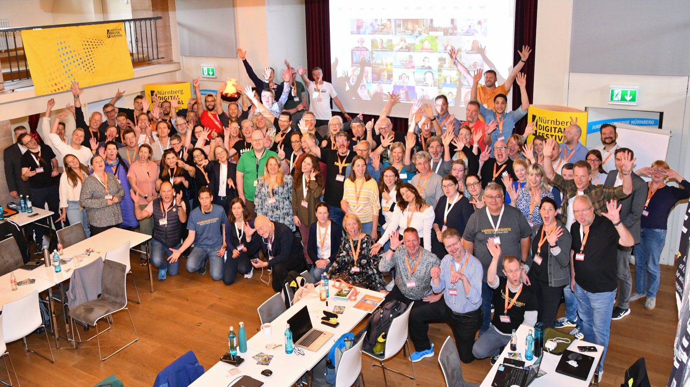

!!! info "Hinweis"
    Die Infoseiten befinden sich noch im Aufbau und enthalten sicher Falschinformationen.
    
# Willkommen zur lernOS Convention 2025 💛

Die **9. lernOS Convention** ([#loscon25](https://cogneon.github.io/mastowall/?hashtags=loscon25,lernos&server=https://colearn.social)) findet vom **1.-2. Juli 2025** auf der **Kaiserburg Nürnberg** & **Online** statt (hybride Veranstaltung). Das Motto ist **“Mind the Knowledge Gap”** (s.a. [Blog-Beitrag](https://cogneon.de/2025/03/02/mind-the-knowledge-gap-das-motto-der-lernos-convention-2025/) dazu).

Die **lernOS Convention** ist das Top-Event zu **Wissensmanagement** und **Lernenden Organisationen** im deutschsprachigen Raum. Der digitale Arbeitsplatz, moderne Intranets, New Ways of Working und persönliches Wissensmanagement für Wissensarbeiter:innen und Lernende Teams sind die zentralen Themen.

Auf diesen **Infoseiten** findet ihr alle Informationen zur Veranstaltung. Die **Tickets** für Vor-Ort- und Online-Teilnahme sind [über den Ticketshop](https://pretix.eu/cogneon/loscon25/) verfügbar.

<button type="button"><a href="https://cogneon.de/event/lernos-convention-2025/" target="_blank">Landing Page</a></button> <button type="button"><a href="https://pretix.eu/cogneon/loscon25/" target="_blank">Tickets</a></button> <button type="button"><a href="https://cogneon.de/2025/03/02/mind-the-knowledge-gap-das-motto-der-lernos-convention-2025/" target="_blank">Blog zum Leitthema</a></button>

## Wichtige Termine

- **21.02.:** Start der Orga-Calls des [Orga-Teams](orga-team.md) (jeweils Freitags, 09:00 - 10:00 Uhr)
- **10.03.:** Golive Landing Page [cogneon.de/loscon25](https://cogneon.de/loscon25) und Ticketshop und Versand Einladung an loscon-Alumni
- **dd.mm.:** Golive [Call for Participation](https://pretalx.com/loscon24/cfp) (Einreichung von Programmvorschlägen)
- **dd.mm.:** Programm Version 1.0 ist fertig
- **23.06.:** Einladung aller Teilnehmer:innen in den Discord-Server der loscon
- **26.06.:** Vorab-Webkonferenz (13:00 - 14:00 Uhr), im Anschluss ist von 14:00-15:00 Uhr Zeit zum betreuten Testen von Discord
- **30.06.:** Aufbau in der Burg (voraussichtlich ab Mittag)
- **30.06.:** [Vorabend-Treffen](eve.md) bei der Eröffnungsveranstaltung des [Nürnberg Digital Festivals](https://nuernberg.digital) im [Künstlerhaus am Hauptbahnhof](https://www.kunstkulturquartier.de/kuenstlerhaus) (kostenlose Anmeldung notwendig)
- **01.-02.07.:** [lernOS Convention 2025](https://cogneon.de/loscon25)
- **11.07.:** loscon-Retro des [Orga-Teams](orga-team.md) (09:00 - 10:00 Uhr)

<a href="https://logwork.com/countdown-timer" class="countdown-timer" data-timezone="Europe/Berlin" data-language="de" data-date="2025-07-01 13:00">loscon25 Countdown</a>

## Eindrücke von früheren lernOS Conventions

<iframe width="560" height="315" src="https://www.youtube-nocookie.com/embed/W0UaN3bcmXc?si=ObdDokULBMWcYWjI" title="YouTube video player" frameborder="0" allow="accelerometer; autoplay; clipboard-write; encrypted-media; gyroscope; picture-in-picture; web-share" referrerpolicy="strict-origin-when-cross-origin" allowfullscreen></iframe>
