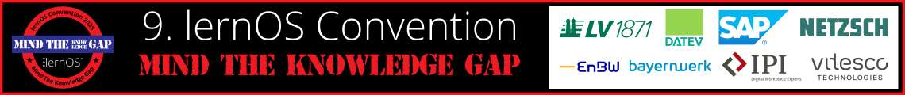

# Willkommen zur lernOS Convention 2025 💛

Die **9. lernOS Convention** ([#loscon25](https://cogneon.github.io/mastowall/?hashtags=loscon25,lernos&server=https://colearn.social)) findet vom **1.-2. Juli 2025** auf der **Kaiserburg Nürnberg**, **Online** und an den drei [loscon Satelliten](./loscon-everywhere.md) München, Hamburg und Berlin statt (hybride Veranstaltung). Das Motto ist **“Mind the Knowledge Gap”**. Ausführliche Informationen zur Themenstellung findest du in [diesem Blog-Beitrag](https://cogneon.de/2025/03/02/mind-the-knowledge-gap-das-motto-der-lernos-convention-2025/).

Die **lernOS Convention** ist das Top-Event zu **Wissensmanagement** und **Lernenden Organisationen** im deutschsprachigen Raum. Der digitale Arbeitsplatz, moderne Intranets, New Ways of Working, persönliches Wissensmanagement und generative KI (GenAI) in der Wissensarbeit sind die zentralen Themen. In diesem Jahr legen aufgrund der kontinuierlichen Veränderungen in turbulenten Zeiten einen Schwerpunkt auf das **strategische Wissensmanagement** und das systematische Schließen von Wissenslücken.

Auf diesen **Infoseiten** findet ihr alle Informationen zur Veranstaltung. Die **Tickets** für Vor-Ort- und Online-Teilnahme sind [über den Ticketshop](https://pretix.eu/cogneon/loscon25/) verfügbar.

<button type="button"><a href="https://pretalx.com/loscon25/schedule/" target="_blank">Programm</a></button> <button type="button"><a href="https://cogneon.de/event/lernos-convention-2025/" target="_blank">Landing Page</a></button> <button type="button"><a href="https://pretix.eu/cogneon/loscon25/" target="_blank">Tickets</a></button> <button type="button"><a href="https://cogneon.de/2025/03/02/mind-the-knowledge-gap-das-motto-der-lernos-convention-2025/" target="_blank">Blog zum Leitthema</a></button>

!!! note "Tipp"
    Wir haben dir **alle Informationen dieser Infoseiten** auch in einer Markdown-Datei zum Herunterladen zusammengestellt. Die kannst du **in ein KI-Tool deiner Wahl hochladen** (z.B. ChatGPT, Copilot, LeChat, Gemini, lokale KI) und beliebig befragen (**Promptbeispiel:** "Ich hänge dir das Programmheft der Veranstaltung lernOS Convention an. Bereite dich darauf vor, dass wir damit arbeiten.").

## Wichtige Termine

- **21.02.:** Start der Orga-Calls des [Orga-Teams](orga-team.md) (jeweils Freitags, 09:00 - 10:00 Uhr)
- **10.03.:** Golive Landing Page [cogneon.de/loscon25](https://cogneon.de/loscon25) und [Ticketshop](https://pretix.eu/cogneon/loscon25/) und Versand Einladung an loscon-Alumni
- **24.03.:** Golive [Call for Participation](https://pretalx.com/loscon25/cfp) (CfP, Einreichung von Programmvorschlägen bis 23.05. um 23:59 Uhr)
- **02.06.:** [Programm](https://pretalx.com/loscon25/schedule/) Version 1.0 ist fertig 🎉
- **16.06.:** Versand der [Future-Backwards-Anleitung](https://loscon.lernos.org/de/gap-closer/) und Einladung aller Teilnehmer:innen in den Discord-Server der loscon
- **26.06.:** Vorab-Webkonferenz (13:00 - 14:00 Uhr), im Anschluss ist von 14:00-15:00 Uhr Zeit zum betreuten Testen von Discord ([Einwahldaten](./pre-call.md))
- **30.06.:** Aufbau in der Burg (ab ca. 13:00 Uhr)
- **30.06.:** [Vorabend-Treffen](eve.md) bei der Eröffnungsveranstaltung des [Nürnberg Digital Festivals](https://nuernberg.digital) im [Künstlerhaus am Hauptbahnhof](https://www.kunstkulturquartier.de/kuenstlerhaus) (kostenlose Anmeldung notwendig)
- **01.-02.07.:** [lernOS Convention 2025](https://cogneon.de/loscon25)
- **11.07.:** loscon-Retro des [Orga-Teams](orga-team.md) (09:00 - 10:00 Uhr)

<a href="https://logwork.com/countdown-timer" class="countdown-timer" data-timezone="Europe/Berlin" data-language="de" data-date="2025-07-01 13:00">loscon25 Countdown</a>

## Archiv

<iframe width="560" height="315" src="https://www.youtube-nocookie.com/embed/W0UaN3bcmXc?si=ObdDokULBMWcYWjI" title="YouTube video player" frameborder="0" allow="accelerometer; autoplay; clipboard-write; encrypted-media; gyroscope; picture-in-picture; web-share" referrerpolicy="strict-origin-when-cross-origin" allowfullscreen></iframe>

---

1. [loscon16](https://wiki.cogneon.de/loscon16) **"20 Jahre Wissensmanagement? Was haben wir gelernt? Wohin geht die Reise?"** (damals noch unter dem Namen KnowTouch)
1. [loscon18](https://wiki.cogneon.de/loscon18) **"Learning Organizations - Where Coroporate HR meets Corporate IT"** (damals noch unter dem Namen KnowTouch)
1. [loscon19](https://wiki.cogneon.de/loscon19) (damals noch unter dem Namen lernOS Camp)
1. [loscon20](https://wiki.cogneon.de/loscon20) (damals noch unter dem Namen lernOS Camp)
1. [loscon21](https://wiki.cogneon.de/loscon21) **"Agil trifft Lernende Organisation"**
1. [loscon22](https://wiki.cogneon.de/loscon22)**"The Re-Return of Knowledge Management"**
1. [loscon23](https://wiki.cogneon.de/loscon23) **"Crafting Learning Environments"**
1. [loscon24](https://wiki.cogneon.de/loscon24) **"Generative KI als Wissensgefährte"**
1. [loscon25](https://wiki.cogneon.de/loscon25) **"Mind the Knowledge Gap"**
