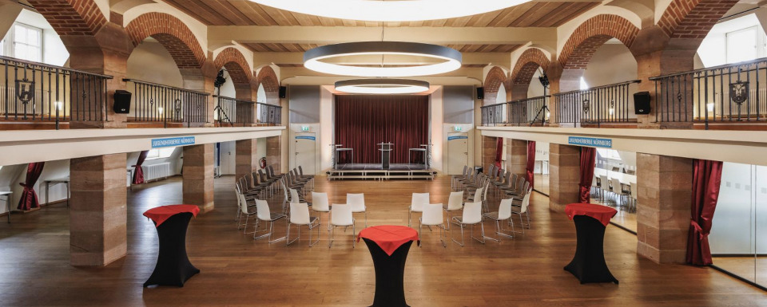
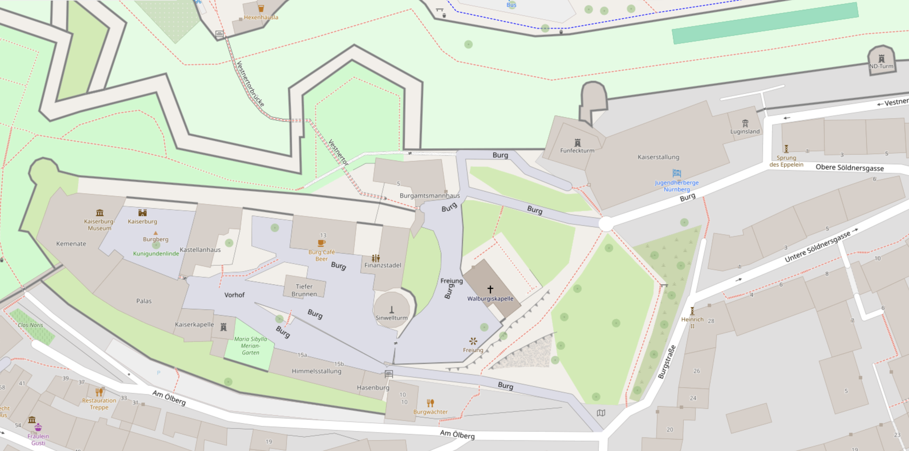

# Lokation

Die [Nürnberger Burg](https://de.wikipedia.org/wiki/N%C3%BCrnberger_Burg) ist das Wahrzeichen der [Stadt Nürnberg](https://de.wikipedia.org/wiki/N%C3%BCrnberg). Sie ist eine sog. Doppelburg, die aus **Kaiserburg** und **Burggrafenburg** besteht. In den ehem. Kaiserstallungen ist heute die **Jugendherberge Nürnberg**, die mit dem [Eppeleinsaal und den neun Seminarräumen](https://www.jugendherberge.de/jugendherbergen/nuernberg/tagen/) ideale Räumlichkeiten für die lernOS Convention bieten (Bildquelle: [jugendherberge.de](https://www.jugendherberge.de/jugendherbergen/nuernberg/tagen/)).

## Adresse

Burg Nürnberg, Burg 2, 90403 Nürnberg ([OpenStreetMap](https://openstreetmap.de/karte/?zoom=19&lat=49.45794&lon=11.07699&layers=B00TT), [Google Map](https://maps.app.goo.gl/VuHSpyymTumF3mmG6)). Der Eingang zur loscon befindet sich an der linken Seite des Gebäudes, ihr müsst ein bisschen den Berg nach oben gehen (unterhalb des Fünfeck-Turms).

## Räume
In der Burg nutzen wir folgende Räumlichkeiten (s.a. [Tagen in Nürnberg](https://www.jugendherberge.de/jugendherbergen/nuernberg/tagen/)):

- **Foyer:** Empfang und Garderobe
- **Eppeleinsaal:** Coworking & Plenum
- **Räume 6-9:** Breakout-Räume für Sessions und Workshops; die Räume sind im Programm benannt als Auenland, Gondor, Mordor und Rohan (von links nach rechts)
- **Foyer (1.Stock):** Sofas für private Gespräche und individuelle Teilnahme an Konferenzen. Dort findet ihr auch den Podcast-Tisch und die KI Bibliothek

## Umgebung
- [Burggarten](https://www.kaiserburg-nuernberg.de/deutsch/garten/index.htm) - schöner Garten direkt gegenüber von unserem Eingang, gut zum Flanieren geeignet
- [Hexenhäusle](https://hexenhaeusle-nuernberg.com/) - Biergarten direkt in der Burgmauer
- [Restaurant Burgwächter](https://burgwaechter-nuernberg.de/) - traditionell fränkisches Restaurant, direkt unterhalb der Burg
- [Hausbrauerei Altstadthof](https://hausbrauerei-altstadthof.de/) - hier gibt es das Nürnberger Rotbier, Ausgangspunkt für eine Tour durch die [historischen Felsengänge](https://www.historische-felsengaenge.de/)
- [Schöner Brunnen](https://de.wikipedia.org/wiki/Sch%C3%B6ner_Brunnen_(N%C3%BCrnberg)) - dreht am Ring, das bring Glück 🤭