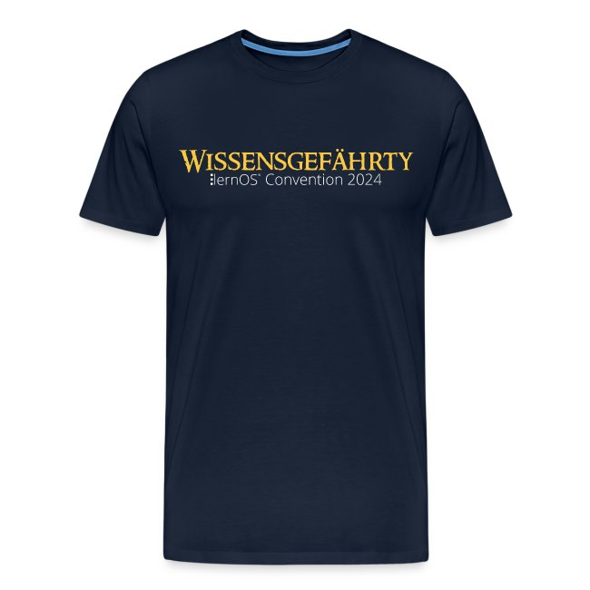

# Merch

Wie jedes Jahr haben wir einen [Merch-Shop auf Spreadshirt](https://loscon24-merch-shop.myspreadshop.de/) angelegt. Es gibt T-Shirts, Tassen und Kappen gegen die Sonne. Das Motiv der Wissensgefährt:innen gibt es in drei Varianten:

1. Männlich: "Wissensgefährte"
1. Weiblich: "Wissensgefährtin"
1. Neutral: "Wissensgefährty" ([nach Phettberg](https://te.ma/art/kl89dy/kronschlaeger-entgendern-phettberg))

Bestellt euren Merch rechtzeitig, damit er noch vor der Veranstaltung ankommt. Auf Produktion und Lieferung haben wir keinen Einfluss und wir können auch keine Fragen dazu beantworten.