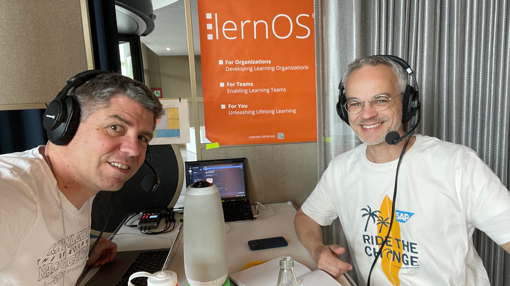

# Podcast-Tisch

Auf der lernOS Convention gibt es einen **Podcast-Tisch**, an dem ihr euch über Podcasting informieren (s.a. [lernOS Podcast Leitfaden](https://cogneon.github.io/lernos-podcasting/de/)), aber auch eigene Podcasts aufnehmen könnt. Bringt dafür am besten eine eigne [microSD-Karte](https://de.wikipedia.org/wiki/MicroSD) mit.

## Remote Podcasting am Podcast-Tisch
Wenn ihr am Podcast-Tisch Remote-Teilnehmer:innen einbinden wollt, könnt ihr das ganz einfach so tun:

1. Bringt euer Notebook mit der Desktop-App von Discord mit
1. Schließt das Notebook an dem USB-C-Kabel am Audiomixer an
1. Wählt in Discord "Rodecaster Chat" als Mikrofon und Lautsprecher aus
1. Tretet in Discord dem Audio-Kanal "Podcast-Tisch" bei (Achtung, es gibt auch einen gleichnamigen Textkanal)
1. Sagt den Remote-Teilnehmenden, dass sie auch in den Kanal kommen sollen
1. Jetzt könnt ihr hybrid miteinander reden

Hinweis: wenn ihr Podcasts aufzeichnet werden alle Remotler in Discord nur auf einer Spur (nicht Multitrack) aufgenommen.

## Technik Podcast-Tisch
1. Audio-Mixer/-Interface [RodeCaster Pro II](https://rode.com/de/interfaces-and-mixers/rodecaster-series/rodecaster-pro-ii)
1. 4x [Beyerdynamic DT297 Headsets](https://www.beyerdynamic.de/dt-297.html)
1. TRRS-Kabel mit USB-C- und Lightning-Adapter. Damit könnt ihr z.B. ein Smartphone für Einspieler, Musik oder Call-in-Shows anschließen
1. USB-C-Kabel, um den RodeCaster an den eigenen PC anzuschließen (z.B. für Aufnahme mit DAW [Reaper/Ultraschall](https://ultraschall.fm/))