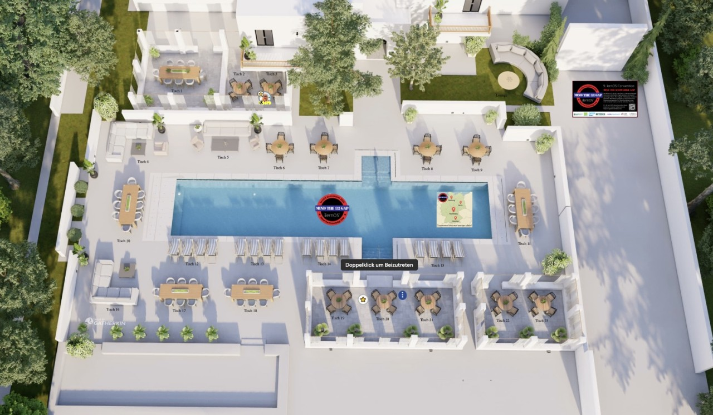

# Remo

Für die **virtuelle Abendveranstaltung** nutzen wir [Remo](https://remo.co), das mittlerweile von events.com gekauft worden ist. In Remo gibt es Tische bzw. bei uns "Haltestellen", auf die ihr euch per Klick darauf stellen könnt. Alle Leute an einer Haltestell können automatisch in einer Videokonferenz miteinander sprechen. Wie bei einer Gesprächsrunde vor Ort könnt ihr euch so dynamisch in Grüppchen zusammenfinden, flanieren oder im Gespräch hängenbleiben. Von Remo gibt es einen [Virutal Networking Guide](https://remo.co/guides/virtual-networking-event).

Nachdem die [Wettervorhersage für Nürnberg](https://www.wetterochs.de/) auf erhöhte Temeraturen zur loscon schließen lässt, haben wir euch einen Pool zur Abkühlung organisiert:

Wer schon bei der loscon20 dabei war, kennt Remo schon. Im Zusammenfassungsvideo ist die Interaktion schön zu sehen:

<iframe width="560" height="315" src="https://www.youtube-nocookie.com/embed/xgYuRQLO7Ok?si=lEFaN-Id24sx6Lxu" title="YouTube video player" frameborder="0" allow="accelerometer; autoplay; clipboard-write; encrypted-media; gyroscope; picture-in-picture; web-share" referrerpolicy="strict-origin-when-cross-origin" allowfullscreen></iframe>

Technische Probleme mit Remo hängen oft daran, dass die [WebRTC](https://de.wikipedia.org/wiki/WebRTC)-basierten Videokonferenzen nicht durch VPNs oder Firewalls (abschalten) gelassen werden, oder der Browser nicht damit zurecht kommt (Chrome verwenden).