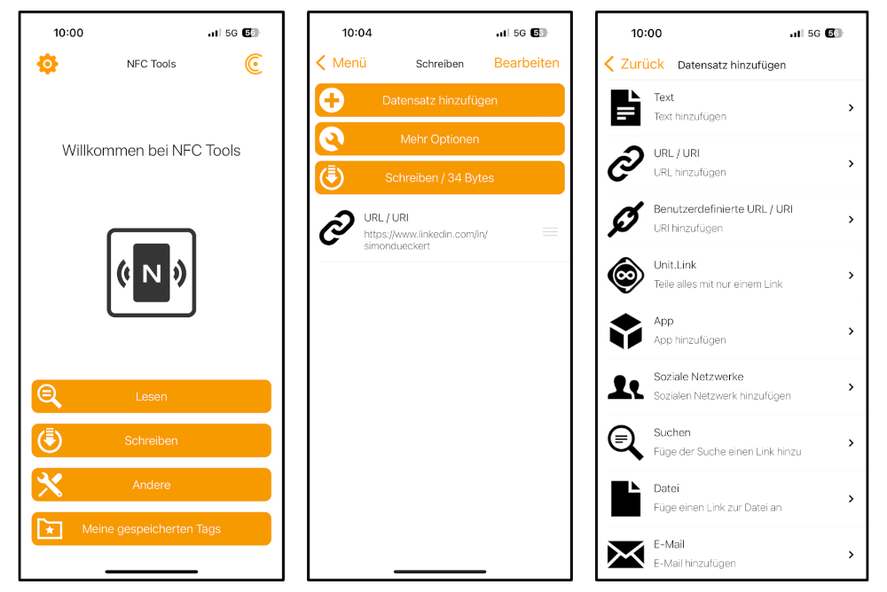

# lernOS Smart Card

Als **Namensschild** erhalten alle Teilnehmer:innen die brandneue **lernOS Smart Card**. Das ist eine Karte, die ihr z.B. mit Name und drei Hashtags beschriften und auch immer wieder verwenden könnt. Auf der Karte ist ein NFC-Tag aufgeklebt (und einer eingebaut, s.u.), den wir vorab mit dem Link zum [lernOS Programm](https://pretalx.com/loscon24/schedule/) beschrieben haben. Mit einer NFC-App könnt ihr auf der Karte aber auch andere Daten speichern (z.B. Link zum eigenen Linkedin/Mastodon-Profil, elektronische Visitenkarte).

## Erste Schritte
Zum beschreiben des NFC-Tags (runder weißer Aufkleber auf der Karte) könnt ihr z.B. die App NFC Tools für [iOS](https://apps.apple.com/de/app/nfc21-tools/id1496636288) oder [Android](https://play.google.com/store/apps/details?id=com.wakdev.wdnfc&hl=de&pli=1) verwenden. Dort wählt ihr "Schreiben" (bzw. bei iPhones „Tag-Typen“, wählt aus was ihr eingeben mögt (URL, Telefonnummer, E-Mail, SMS, FaceTime, Kurzbefehl…) und könnt dann diese verschiedenen Arten von Datensätzen auf den Tag schreiben:

Einige Ideen für die Verwendung (Eurer Fantasie soll aber keine Grenze gesetzt sein):

1. **URL/URI:** schreibt den Link zu Eurem Linkedin-/Mastodon-Profil oder Eurem Blog auf den Tag (wie im Screenshot oben)
1. **Soziale Netzwerke:** wie oben, aber mit der direkten Auswahl von sozialen Netzwerken
1. **E-Mail:** Direkte Kontaktaufnahme per E-Mail (wie *mailto:* Link)
1. **Kontakt:** Elektronische Visitenkarte mit Name, Firma, Adresse, Telefon, E-Mail und Webseite
1. **uvm.**

## Zusatz-Challenge für Technik-Begeisterte
Die lernOS Smartcard hat einen Mifare Classic 1k RFID-Chip, weil die als einzig wiederbeschreibbare Karte [bei Wir machen Druck angeboten](https://www.wir-machen-druck.de/bedruckte-rfid-plastikkarten-extrem-guenstig,category,14294.html) wurde. Leider stellte sich heraus, dass dieser Chip von iPhone und Android nicht ohne weiteres lesbar und beschreibbar ist 🥲

Deswegen haben wir auf die Smart Card zusätzlich einen NTAG215 Chip geklebt, den ihr mit den o.g. Apps beschreiben könnt (z.B. mit Link zu eurem Linkedin-Profil). Es gibt aber wohl [Möglichkeiten](https://stackoverflow.com/questions/28575454/format-read-write-ndef-mifare-1k-card-using-libnfc), den Mifare-Chip im kompatiblen Format NDEF zu beschreiben. Wer herausfindet, wie das geht, bekommt von uns ein lernOS Maskottchen Suri.

**Links:**

- [AN1305 MIFARE Classic as NFC Type MIFARE Classic Tag](https://www.nxp.com/docs/en/application-note/AN1305.pdf)
- [Adafruit Library](https://github.com/adafruit/Adafruit-PN532/blob/master/examples/mifareclassic_formatndef/mifareclassic_formatndef.ino)
- [Mimcd](https://code.google.com/archive/p/micmd/)

Wer auf der lernOS Convention ein bisschen basteln will, wir haben einen [ACR122U USB NFC Reader](https://www.acs.com.hk/en/products/3/acr122u-usb-nfc-reader/) und PN532-Module dabei. 😉

- [AN1305 MIFARE Classic as NFC Type MIFARE Classic Tag](https://www.nxp.com/docs/en/application-note/AN1305.pdf)
- [Adafruit Library](https://github.com/adafruit/Adafruit-PN532/blob/master/examples/mifareclassic_formatndef/mifareclassic_formatndef.ino)
- [Mimcd](https://code.google.com/archive/p/micmd/)

Wer auf der lernOS Convention ein bisschen bausteln will, wir haben einen [ACR122U USB NFC Reader](https://www.acs.com.hk/en/products/3/acr122u-usb-nfc-reader/) und PN532-Module dabei. 😉
